<h3><code>~/thiago@github $ whoami</code></h3>
<table>
  <tr>
    <td valign="top"></td>
    <td valign="top"></td>
  </tr>
</table>

 

<h3><code>~/thiago@github $ ./contributions.sh</code></h3>

  

 

### ⚙️ GitHub Analytics

<table>
  <tr>
    <td>
      
    </td>
    <td>
      
    </td>
    <td>
       
      
    </td>
  </tr>
</table>

---

### 🏆 GitHub Profile Trophy

  

---

  <h3><b>📍 Profile Visitor Count</b></h3>

  

 

<h3><code>~/thiago@github $</code></h3>

